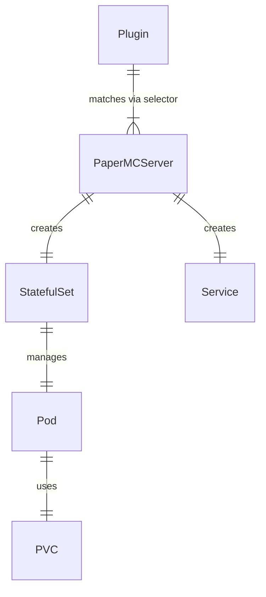

# Design

This document covers the system architecture and design decisions of Minecraft Operator.

!!! tip "Full Design Document"

    For the complete design document, see [DESIGN.md](https://github.com/lexfrei/minecraft-operator/blob/master/DESIGN.md) in the repository.

## Goals

1. **Version Control** — Automatic tracking of PaperMC server and plugin updates
2. **Compatibility Guarantee** — Constraint solver finds newest compatible versions
3. **Predictable Updates** — Updates only during defined maintenance windows
4. **Graceful Updates** — Proper RCON shutdown before updates

## Non-Goals

- **High Availability** — 5-10 minute downtime during updates is acceptable
- World backups (separate tooling)
- Update rollbacks (world format changes are destructive)
- Performance monitoring (TPS, lag)
- Horizontal scaling
- Zero-downtime updates

## System Architecture

```text
┌─────────────────────────────────────────────────┐
│              K8s API Server                      │
│                                                  │
│  ┌──────────────┐       ┌──────────────────┐   │
│  │ Plugin CRD   │       │ PaperMCServer    │   │
│  │              │       │ CRD              │   │
│  └──────────────┘       └──────────────────┘   │
└────────────────┬────────────┬───────────────────┘
                 │            │
                 │   Watch    │
                 │            │
┌────────────────▼────────────▼───────────────────┐
│         Minecraft Operator                       │
│                                                  │
│  ┌─────────────────────────────────────────┐   │
│  │   Plugin Controller                      │   │
│  │   - Match servers via selector           │   │
│  │   - Fetch from plugin APIs               │   │
│  │   - Run solver for all matched servers   │   │
│  └─────────────────────────────────────────┘   │
│                                                  │
│  ┌─────────────────────────────────────────┐   │
│  │   PaperMCServer Controller               │   │
│  │   - Find matched plugins                 │   │
│  │   - Ensure StatefulSet exists            │   │
│  │   - Run solver for Paper version         │   │
│  └─────────────────────────────────────────┘   │
│                                                  │
│  ┌─────────────────────────────────────────┐   │
│  │   Update Controller                      │   │
│  │   - Watch cron schedule                  │   │
│  │   - Graceful shutdown via RCON           │   │
│  │   - Update JARs and restart              │   │
│  └─────────────────────────────────────────┘   │
└────────────────┬────────────┬───────────────────┘
                 │            │
        ┌────────┴────────┐   │
        │                 │   │
┌───────▼──────┐  ┌──────▼───▼───────┐
│  Plugin APIs │  │  Minecraft Pods   │
│  - Hangar    │  │  + RCON           │
│  - Modrinth  │  │  + StatefulSet    │
└──────────────┘  └───────────────────┘
```

## Component Interactions

### Plugin → PaperMCServer (Declarative)

1. Plugin defines `instanceSelector` labels
2. Plugin Controller finds all matched servers
3. Solver calculates best version for all matched servers
4. PaperMCServer Controller reads resolved versions from Plugin.status

### PaperMCServer → Plugin (Reactive)

1. When labels change on PaperMCServer
2. Plugin Controller recalculates matching
3. May trigger new solver solution

### Update Flow

1. Trigger: Cron in `PaperMCServer.spec.updateSchedule`
2. Update Controller coordinates:
   - Reads resolved versions from all matched Plugins
   - Reads `availableUpdate` from PaperMCServer.status
   - Performs graceful shutdown via RCON
   - Updates JARs in `plugins/update/` directory
   - Deletes pod for StatefulSet recreation

## Controller Details

### Plugin Controller

**Watches**: Plugin CRDs

**Reconciliation loop**:

1. Fetch metadata from plugin repository (Hangar)
2. Find all PaperMCServer instances matching `instanceSelector`
3. Run constraint solver to find best compatible version
4. Update Plugin.status with resolved version and matched instances
5. Trigger reconciliation on matched PaperMCServer resources

### PaperMCServer Controller

**Watches**: PaperMCServer CRDs, matched Plugin CRDs

**Reconciliation loop**:

1. Ensure StatefulSet exists with correct configuration
2. Ensure Service exists for server access
3. Find all Plugin resources that match this server
4. Based on `updateStrategy`:
   - `latest`: Query Docker Hub for newest version
   - `auto`: Run solver for plugin compatibility
   - `pin`/`build-pin`: Validate pinned version
5. Update status with current/desired versions

### Update Controller

**Watches**: PaperMCServer CRDs (cron-triggered)

**Update process**:

1. Check if maintenance window is active
2. Check if update is available and `updateDelay` satisfied
3. Download plugin JARs to `/data/plugins/update/`
4. Send RCON `save-all` command
5. Send RCON `stop` command
6. Wait for graceful shutdown
7. Update StatefulSet image tag
8. Delete pod → StatefulSet recreates with new version

## Resource Relationships



### Selector Conflict Resolution

When multiple Plugins match the same server:

1. If any has `updateStrategy: latest`: solver picks optimal version
2. If all have `updateStrategy: pin`: highest semver wins (with warning)

## Version Resolution

### Paper Version Resolution

Based on `updateStrategy`:

| Strategy | Resolution |
|----------|------------|
| `latest` | Newest from Docker Hub (ignores plugins) |
| `auto` | Solver finds compatible version |
| `pin` | Specified version, latest build |
| `build-pin` | Exact version and build |

### Plugin Version Resolution

Based on `updateStrategy`:

| Strategy | Resolution |
|----------|------------|
| `latest` | Newest compatible with ALL matched servers |
| `auto` | Solver picks optimal version |
| `pin` | Specified version |
| `build-pin` | Exact version and build |

## Edge Cases

### Repository Unavailable

- Use cached `status.availableVersions`
- Mark `repositoryStatus: orphaned`
- Log warning

### Plugin Without Version Metadata

- Assume compatibility with warning
- Use `compatibilityOverride` if set

### No Compatible Version Found

- Emit warning in Plugin.status conditions
- Keep current version installed
- Set `updateBlocked: true` on server

## See Also

- [Constraint Solver](solver.md) — Version resolution algorithm
- [Update Strategies](../configuration/update-strategies.md) — Detailed strategy guide
- [DESIGN.md](https://github.com/lexfrei/minecraft-operator/blob/master/DESIGN.md) — Full design document
