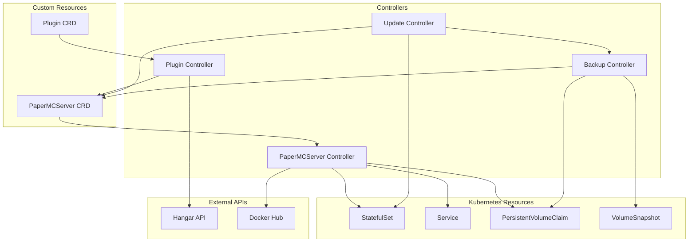

# Architecture

This section covers the internal architecture of Minecraft Operator.

## Overview

The operator consists of four main controllers that work together:

## Controllers

| Controller | Responsibility |
|------------|----------------|
| **Plugin Controller** | Fetches plugin metadata, runs compatibility solver |
| **PaperMCServer Controller** | Manages StatefulSet, Service, resolves versions |
| **Update Controller** | Executes scheduled updates with graceful shutdown |
| **Backup Controller** | Creates VolumeSnapshot backups with RCON consistency hooks |

## Sections

-   :material-file-document:{ .lg .middle } **Design**

    ---

    Complete system architecture and design decisions

    [:octicons-arrow-right-24: Design](design.md)

-   :material-puzzle:{ .lg .middle } **Constraint Solver**

    ---

    How version compatibility is resolved

    [:octicons-arrow-right-24: Solver](solver.md)

-   :material-package-variant:{ .lg .middle } **Dependencies**

    ---

    External libraries, container images, and APIs

    [:octicons-arrow-right-24: Dependencies](dependencies.md)

## Key Design Principles

### Not High-Availability

This operator is designed for single-instance Minecraft servers. 5-10 minutes of downtime during updates is acceptable by design.

### Declarative Plugin Management

Plugins are matched to servers via label selectors, enabling:

- Many-to-many relationships between plugins and servers
- Centralized plugin management across multiple servers
- Automatic version resolution per server

### Constraint Solving

The operator uses a constraint solver to find compatible versions:

- **For Plugins**: Find maximum plugin version compatible with ALL matched servers
- **For Servers**: Find maximum Paper version compatible with ALL matched plugins

### Graceful Updates

Updates are applied safely:

1. Pre-update VolumeSnapshot backup (when `backup.beforeUpdate` is enabled)
2. RCON `save-all` command saves world data
3. RCON `stop` command gracefully stops the server
4. Pod termination respects `terminationGracePeriodSeconds`
5. StatefulSet recreates the pod with new version

## Technology Stack

| Component | Technology |
|-----------|------------|
| Framework | controller-runtime v0.22+ |
| Language | Go 1.26+ |
| Container | distroless/static-debian12:nonroot |
| Charts | Helm 3.14+ |
| API Group | `mc.k8s.lex.la/v1beta1` |

## Next Steps

- [Design](design.md) — Detailed architecture documentation
- [Constraint Solver](solver.md) — Version resolution algorithm
