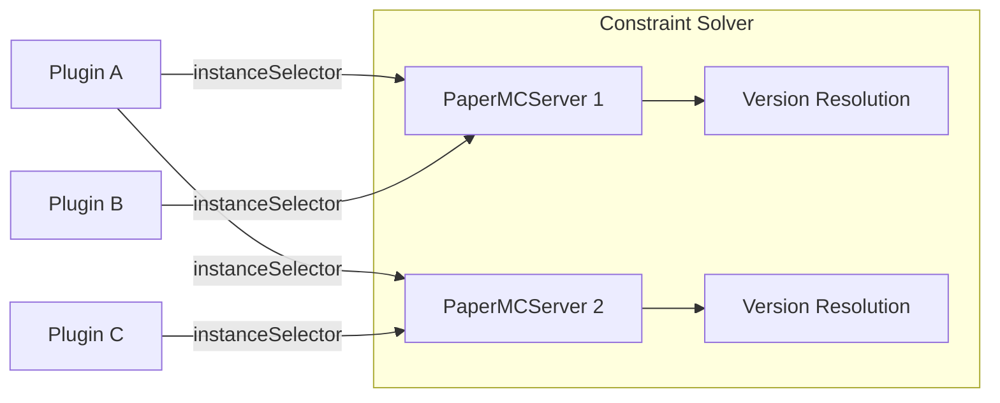

# Configuration

This section covers the configuration of Minecraft Operator's Custom Resource Definitions (CRDs).

## Custom Resources

The operator defines two main CRDs:

| Resource | API Group | Description |
|----------|-----------|-------------|
| **PaperMCServer** | `mc.k8s.lex.la/v1alpha1` | Defines a Minecraft server instance |
| **Plugin** | `mc.k8s.lex.la/v1alpha1` | Defines a plugin for matched servers |

## Resource Relationship



Plugins are matched to servers via label selectors. The constraint solver ensures all plugins are compatible with the selected Paper version.

## Sections

<div class="grid cards" markdown>

-   :material-server:{ .lg .middle } **PaperMCServer**

    ---

    Complete reference for PaperMCServer CRD fields

    [:octicons-arrow-right-24: PaperMCServer](papermcserver.md)

-   :material-puzzle:{ .lg .middle } **Plugin**

    ---

    Complete reference for Plugin CRD fields

    [:octicons-arrow-right-24: Plugin](plugin.md)

-   :material-update:{ .lg .middle } **Update Strategies**

    ---

    Detailed guide to version management strategies

    [:octicons-arrow-right-24: Update Strategies](update-strategies.md)

</div>

## Quick Reference

### PaperMCServer Update Strategies

| Strategy | Description | Use Case |
|----------|-------------|----------|
| `latest` | Always newest Paper version | Testing, bleeding edge |
| `auto` | Solver picks best compatible version | **Recommended for production** |
| `pin` | Fixed version, auto-update builds | Stability with security updates |
| `build-pin` | Fully pinned version and build | Maximum stability |

### Plugin Update Strategies

| Strategy | Description | Use Case |
|----------|-------------|----------|
| `latest` | Always newest plugin version | Most plugins |
| `pinned` | Fixed version, no auto-updates | Known stable versions |

## Example Configurations

### Production Server with Plugins

```yaml
apiVersion: mc.k8s.lex.la/v1alpha1
kind: PaperMCServer
metadata:
  name: production
  labels:
    environment: production
spec:
  updateStrategy: "auto"
  updateSchedule:
    checkCron: "0 3 * * *"
    maintenanceWindow:
      enabled: true
      cron: "0 4 * * 0"
---
apiVersion: mc.k8s.lex.la/v1alpha1
kind: Plugin
metadata:
  name: essentialsx
spec:
  source:
    type: hangar
    project: "EssentialsX/Essentials"
  updateStrategy: "latest"
  instanceSelector:
    matchLabels:
      environment: production
```

### Pinned Version for Stability

```yaml
apiVersion: mc.k8s.lex.la/v1alpha1
kind: PaperMCServer
metadata:
  name: stable
spec:
  updateStrategy: "pin"
  version: "1.21.1"  # Pinned Minecraft version
  updateSchedule:
    checkCron: "0 3 * * *"
```

## Next Steps

- [PaperMCServer Reference](papermcserver.md) — All server configuration options
- [Plugin Reference](plugin.md) — All plugin configuration options
- [Update Strategies](update-strategies.md) — Deep dive into version management
